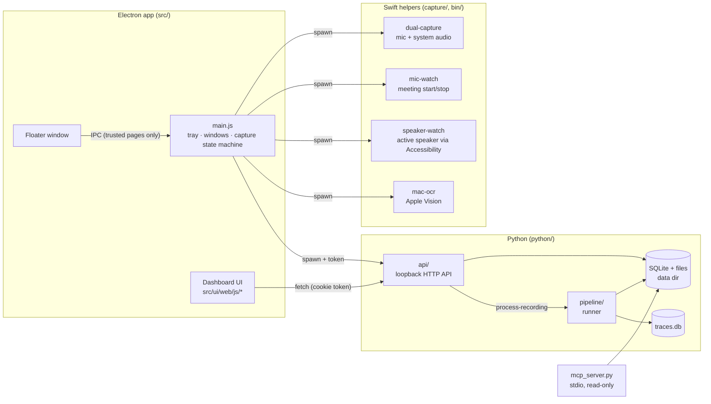

# Architecture

Cora is three cooperating processes on one Mac, with user data in a single private directory.

## Recording → notes

1. **Capture.** `mic-watch` notices a meeting app using the mic; `main.js` starts `dual-capture`
   (mic and system audio as two tracks in one `.mov`) and `speaker-watch` (who's speaking, from the
   meeting app's Accessibility tree). Screenshots are OCR'd by `mac-ocr`.
2. **Archive** (`voice_memo_pipeline.py`): the recording moves from `inbox/` into
   `recordings/<id>/` — the two-track `audio.mov` plus a mixed `playback.m4a` for the player.
3. **Pipeline** (`pipeline/runner.py`):
   - `audio`: mix tracks for ASR, detect silence;
   - `context` + `transcribe`: pause-bounded chunks, each with a Whisper prompt built from
     attendees, nearby screenshot text, title, notes and vocabulary;
   - `speakers`: Accessibility timeline, then mic-vs-system loudness (you vs. them);
   - `romanize`: Devanagari → Romanized Hinglish (local LLM, validated, rule-based fallback);
   - `speaker_guess`: the local LLM names remote turns, validated against roster and evidence;
   - `notes`: enhanced notes and summaries with a local LLM (or an opt-in cloud model).
4. **Serve.** The UI and MCP read the results; the transcript editor writes corrections back and
   logs them as training data.

## Boundaries worth knowing

- **Security:** the API only answers loopback requests carrying the per-launch token (`api/auth.py`);
  renderers are sandboxed with a strict CSP and only trusted pages may use IPC (`src/main/security.js`).
- **Privacy:** outbound features (cloud LLMs, tracing, VM sync, contribution) are opt-in and all
  pass through `python/policy.py`, which enterprise lockdown turns off entirely.
- **Paths:** `python/paths.py` (and `src/main/paths.js`) decide where code and data live; nothing
  else hardcodes a path.
- **Observability:** every model call goes through `ai_trace.span(...)` — see [TRACING.md](TRACING.md).
